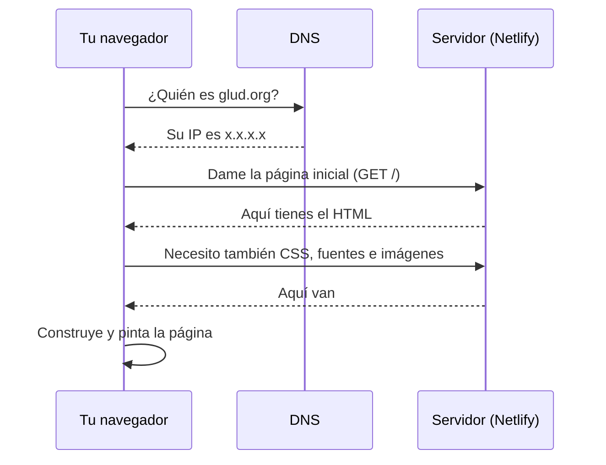

# S0 — ¿Qué es este sitio y cómo llega a internet?

> **Pregunta guía:** escribiste `glud.org` y presionaste Enter. Entre ese instante y la página pintada en tu pantalla pasaron muchas cosas. Antes de leer una línea más: **¿cuántas crees que fueron?** Anota tu número y tus hipótesis. Al final de la sesión volvemos a esto.

---

## Objetivos de la sesión

Al terminar vas a poder:

1. Nombrar las piezas de un sitio web (HTML, CSS, JS) y qué hace cada una.
2. Contar el viaje completo de una petición web, de punta a punta.
3. Explicar la diferencia entre sitio estático y dinámico, y por qué glud.org eligió ser estático.
4. Clonar el repositorio del sitio y levantarlo en tu propio computador.
5. Identificar las herramientas del taller y para qué sirve cada una.

---

## 1. Las tres capas de todo sitio web

Todo lo que ves cuando abres una página —por compleja que sea— se construye con tres tecnologías que trabajan juntas:

| Capa | Tecnología | Responsabilidad | Analogía |
| --- | --- | --- | --- |
| Estructura | HTML | Qué hay y qué significa cada cosa | El esqueleto y los órganos |
| Presentación | CSS | Cómo se ve: colores, tamaños, posiciones | La piel, ropa y postura |
| Comportamiento | JavaScript | Qué pasa cuando interactúas | Los reflejos y reacciones |

### Analogía de Minecraft

Piensa en una construcción en Minecraft:

- **HTML** son los bloques puestos: dónde está la puerta, dónde la mesa, cuántos pisos tiene la casa. Si quitas bloques, la estructura cambia.
- **CSS** son los materiales y acabados: cambiar madera por cuarzo no mueve nada, solo cambia cómo luce cada superficie.
- **JavaScript** son los mecanismos de redstone: puertas que se abren al acercarte, luces que prenden. Sin redstone la casa funciona (entras y sales), pero no reacciona a ti.

> **Dato clave:** glud.org funciona casi sin redstone. Su página principal carga unos ~8 KB de JavaScript propio. Todo lo demás es estructura y presentación pura. Más adelante entenderás por qué eso es una decisión deliberada y muy inteligente.

---

## 2. El viaje de una petición

Cuando presionas Enter, esto sucede (en menos de un segundo):

1. El navegador traduce `glud.org` a una dirección IP usando el sistema DNS (una libreta global que conecta nombres con números).
2. El navegador le pide el documento HTML a esa dirección (petición HTTP GET).
3. El servidor responde con el archivo HTML.
4. El navegador lee el HTML y descubre que además necesita CSS, imágenes y fuentes: las pide también.
5. Con todo eso, construye la página y la pinta en pantalla.



### Analogía de comida

Ir a un restaurante:

- **DNS** es preguntarle al portero dónde queda "La Casa del Parche" porque tú solo sabes el nombre, no la dirección.
- **El HTML** es el plato principal que pediste: sin él no hay almuerzo.
- **CSS, imágenes y fuentes** son la sal, la bebida y la servilleta: el plato principal podría llegar solo, pero la experiencia completa necesita esos acompañantes.
- **Pintar la página** es servir todo junto en la mesa: hasta que no llega la última cosa, el cliente sigue esperando.

---

## 3. Estático vs dinámico: la decisión más importante del curso

Hay dos formas grandes de generar el HTML que recibe el navegador:

### Sitio dinámico (SSR: renderizado en servidor)

Cada vez que alguien pide la página, un programa en el servidor **arma el HTML en ese momento**, quizá consultando bases de datos, y lo envía.

### Sitio estático (SSG: generación de sitio estático)

El HTML se arma **una sola vez, antes**, cuando el equipo publica cambios. El servidor solo guarda archivos ya terminados y los entrega tal cual a todo el mundo.

### Analogía de comida

- **SSR es un restaurante a la carta:** cada pedido se cocina en el momento. Fresco y personalizado, pero tarda y requiere cocineros pendientes siempre.
- **SSG es un buffet:** la comida se preparó antes del servicio. Cuando llegas, se te sirve al instante. Si la receta cambia, se recocina toda la bandeja una vez, y todos los comensales siguientes reciben la nueva.

### Analogía de Minecraft

- **SSR** es generar un chunk nuevo cada vez que un jugador lo pisa: el motor calcula terreno ahí mismo.
- **SSG** es tener el mundo pre-generado: caminas fluido porque nadie está calculando nada mientras juegas.

### Por qué glud.org es estático

El contenido del sitio (quiénes somos, la agenda, los cursos) **cambia poco**: unas veces al mes. No hay sesiones de usuarios ni datos personales en tiempo real. Para ese caso:

| Criterio | Estático | Dinámico |
| --- | --- | --- |
| Velocidad de carga | Altísima: solo se entrega archivos | Depende de que el servidor cocine |
| Costo de hosting | Muy bajo o gratis (solo archivos) | Se paga servidor vivo siempre |
| Seguridad | Superficie mínima: no hay base de datos expuesta | Cada punto dinámico es un posible ataque |
| Mantenimiento | Publicar y olvidar | Hay que vigilar el servidor a diario |

> **Lección UX antes de tocar código:** la decisión "estático vs dinámico" no es técnica, es de producto. Primero se pregunta qué necesita el usuario y qué tan seguido cambia el contenido. La tecnología viene después. Este patrón de razonamiento se repite TODO el semestre.

---

## 4. El repositorio como fuente de verdad

El sitio vive en [gitlab.com/GLUD/glud-web/frontend/glud-website](https://gitlab.com/GLUD/glud-web/frontend/glud-website). Ahí ocurre todo:

```
main        # Producción: lo que ve el mundo en glud.org
dev         # Integración: los cambios aprobados se prueban juntos aquí
feat/*      # Ramas personales donde cada quien trabaja su cambio
```

El flujo del grupo (y el que usaremos en este taller):

1. Un cambio nace en una rama personal (`feat/agenda-filtro`).
2. Se propone su inclusión con un Merge Request hacia `dev`.
3. Otra persona revisa el código y aprueba.
4. `dev` se integra a `main` cuando el conjunto está estable.
5. Al llegar a `main`, el despliegue a producción se dispara solo: Netlify toma los archivos generados y los publica en glud.org.

> **Analogía de Minecraft:** `feat/*` es tu mundo local donde experimentas sin miedo (puedes explotar todo). `dev` es el servidor del grupo donde los mundos se combinan y alguien revisó que no dejaras cráteres. `main` es el mapa final que se comparte a toda la comunidad: si rompes ese, todos lo sufren.

---

## 5. Las herramientas del taller

| Herramienta | Para qué sirve | Analogía rápida |
| --- | --- | --- |
| Git | Registrar la historia de cambios del código | El historial de comandos del juego: puedes volver atrás |
| GitLab | Alojar el repositorio y gestionar revisiones | El servidor donde viven los mundos compartidos |
| Node.js | Ejecutar JavaScript fuera del navegador (para construir el sitio) | La cocina donde se prepara el buffet |
| pnpm | Instalar las librerías que el proyecto necesita | El inventario: trae y organiza los materiales |
| VS Code | Editor de código | Tu mesa de crafteo |
| Astro (framework) | Generar el sitio estático | La fábrica de chunks pre-generados |

> Sobre **pnpm y no npm**: hay razones técnicas buenas (velocidad, orden, espacio en disco) y una anecdótica (en algunos equipos npm rompe los registros de dependencias). Lo destripamos completo en la S6. Por ahora solo úsalo.

---

## En el sitio real: verificación en 30 segundos

Abre [glud.org](https://glud.org), presiona `F12` (abre DevTools, tu instrumento central este semestre) y revisa:

1. Pestaña **Network**: recarga la página y mira todas las peticiones. Encuentra el documento HTML, el CSS y las fuentes. ¿Ves mucho JS? Casi nada.
2. Pestaña **Elements**: este es el HTML real que estudiaste hoy. Nada más y nada menos.
3. Botón derecho en cualquier parte > "Inspeccionar": el elemento exacto resaltado.

Eso acabas de hacer es lo que haremos todas las semanas: mirar producción de frente, sin miedo.

---

## Reto de la sesión

### Nivel base (obligatorio)

1. Instala las herramientas siguiendo la guía en clase (Git, Node, pnpm vía `corepack`, VS Code).
2. Clona el repositorio del sitio:
   ```bash
   git clone https://gitlab.com/GLUD/glud-web/frontend/glud-website.git
   cd glud-website
   ```
3. Instala dependencias y levanta el sitio:
   ```bash
   corepack pnpm install
   corepack pnpm dev
   ```
4. Abre `http://localhost:4321` y confirma que ves el sitio corriendo desde TU computador.
5. Escribe **3 dudas** que te quedaron explorando el código y tráelas la próxima sesión.

### Nivel reto

6. Con DevTools abierto (pestaña Network), identifica: cuántas peticiones hace la carga completa, cuántos KB pesa en total, y qué tipo de recurso domina ese peso. Trae esos 3 números anotados.
7. Explora el repositorio clonado y anota qué carpetas encuentres en `src/`. No intentes entenderlas todavía: solo enuméralas y ponles una hipótesis de qué contiene cada una.

---

## Checklist de salida

Marca solo si puedes hacerlo SIN mirar la teoría:

- [ ] Dibujo de memoria el viaje de una petición web (mínimo 5 pasos).
- [ ] Explico estático vs dinámico con mis propias palabras y sé cuál usa glud.org y por qué.
- [ ] Tengo el sitio corriendo localmente desde mi computador.
- [ ] Sé qué ramas existen en el repositorio y qué guarda cada una (`main` vs `dev`).
- [ ] Escribí mis 3 dudas para la próxima sesión.

Si marcaste todas: bienvenido al semestre. Si alguna falla: vuelve a la sección correspondiente, la teoría no muerde.

---

## Recursos extra

- [Cómo funciona la web (MDN)](https://developer.mozilla.org/es/docs/Learn/Getting_started_with_the_web/how_the_Web_works) — la explicación canónica del viaje de una petición.
- [¿Qué es un servidor? (web.dev)](https://web.dev/articles/web-server-intro?hl=es-419)
- [Astro: qué es](https://docs.astro.build/es/concepts/why-astro/) — léelo ligero, lo retomamos en S7.

---

<div align="center">

[← Indice](../../Indice.md) · [Siguiente: S1 Fundamentos UX →](../s1-fundamentos-ux/README.md)

</div>
